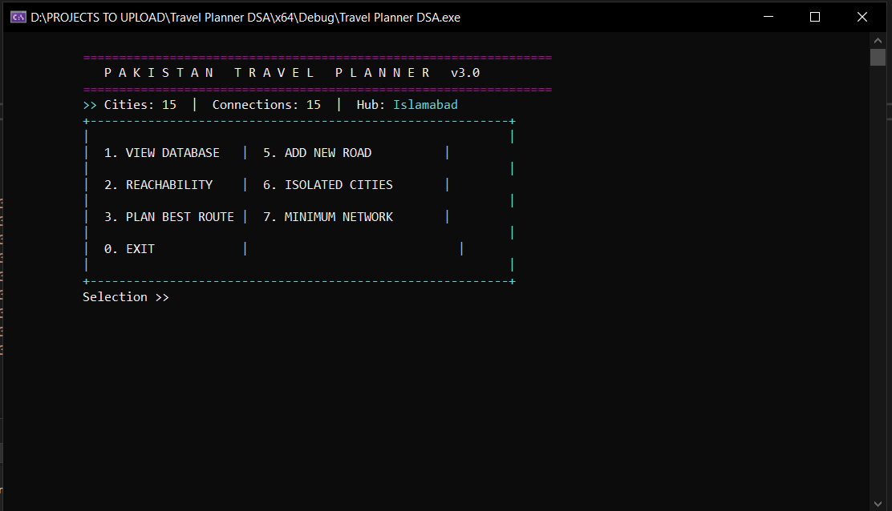
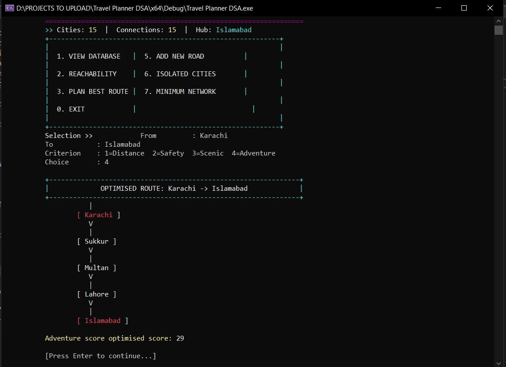

# 🇵🇰 Mini Travel Planner (DSA Project)

A sophisticated terminal-based travel planning tool built in **C++** using **Linked-List Graphs** and classic graph algorithms. This project allows users to plan optimized routes between Pakistani cities based on distance, safety, scenic beauty, or adventure ratings.

## 🚀 Overview
The application utilizes advanced file handling to fetch city and road data from a local database (`cities.txt`). It then constructs a bidirectional graph to calculate paths and analyze network connectivity.

## ✨ Key Features
* **Intelligent Pathfinding:** Find the "best" route using Dijkstra’s algorithm based on 4 customizable criteria: Distance, Safety, Scenic Beauty, or Adventure.
* **Reachability Analysis:** Uses Breadth-First Search (BFS) to determine all cities reachable from a specific starting point.
* **Infrastructure Optimization:** Implements Prim’s Minimum Spanning Tree (MST) to find the most efficient network to connect all cities.
* **Dynamic Database:** Add new roads through the interface, which are automatically persisted to the text database via file handling.
* **Graph Diagnostics:** Identify isolated cities with no road connections.

## 📸 Screenshots
<p align="center">
  
  
</p>

<p align="center">
  
  
</p>

> **Note:** Ensure the image names in the `Screenshorts/` folder match the names used in the code above (e.g., `menu.png`, `route.png`).

## 📊 Graph Architecture
The project is built using a custom graph implementation:
- **Nodes (Cities):** Stored in a singly-linked list.
- **Edges (Roads):** Managed via an adjacency list per city.
- **Edge Weighting:** Each road stores KM distance, safety (1–10), scenic (1–10), and adventure (1–10) ratings.

## 💻 Tech Stack
- **Language:** C++17
- **IDE:** Visual Studio 2022
- **Concepts:** Data Structures (Graphs, Linked Lists), File I/O, Algorithm Analysis.

## 🛠️ Build & Run
Ensure you have a `cities.txt` file in the project directory.

```bash
# g++ (Linux / macOS / WSL)
g++ -std=c++17 -O2 -Wall -o travel_planner travel_planner.cpp
./travel_planner

# MSVC (Windows)
cl /EHsc /std:c++17 travel_planner.cpp
travel_planner.exe
